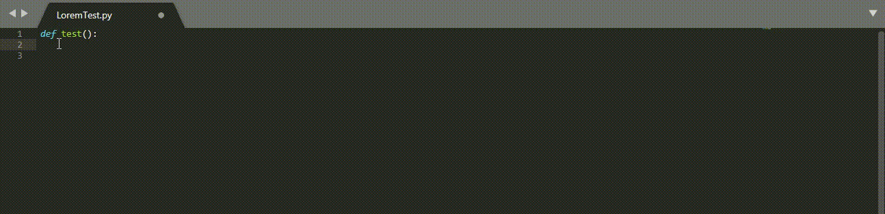

# LoremGenerator
This Sublime Text package allows you to generat lorem text randomly from 1 to 500 words. It works with Sublime Text's auto-completion.

From "lo" to "lorem" typed, it will generates 25 words.

The allowed range is 0 to 500. More than 500 will generates 500 words.

It's easy to use, there is an example :

 - Lorem : Will generate 25 Lorem words
 - Lorem287 : Will generate 287 Lorem words
 - Lorem 800 : Will generate 500 Lorem words

If you have any suggestions to improve this plugin, please send me a message at the 
email specified in the header of the file named "LoremGenerator.py"

This plugin works with every languages.

Here is an example :

